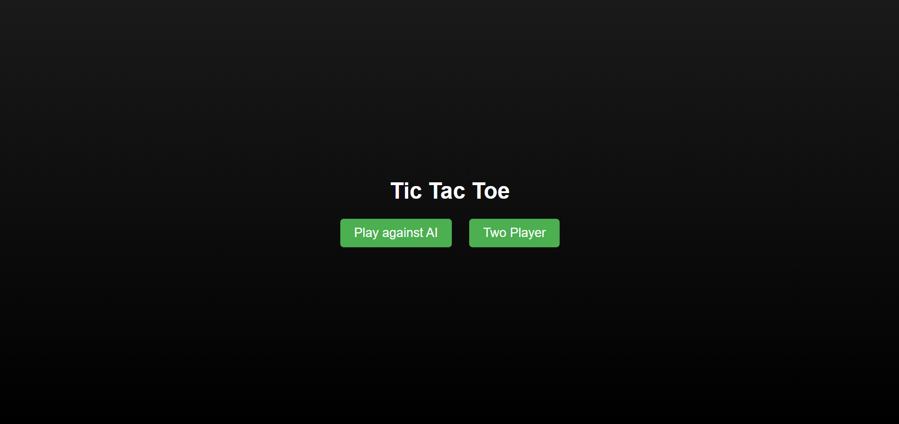
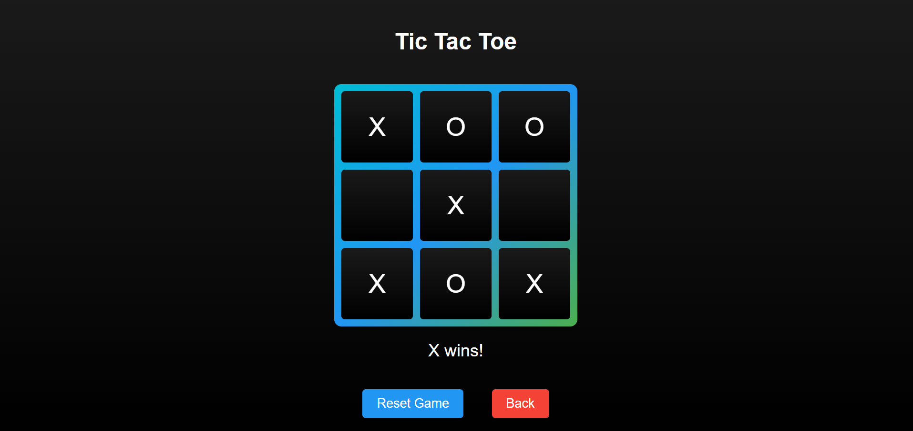
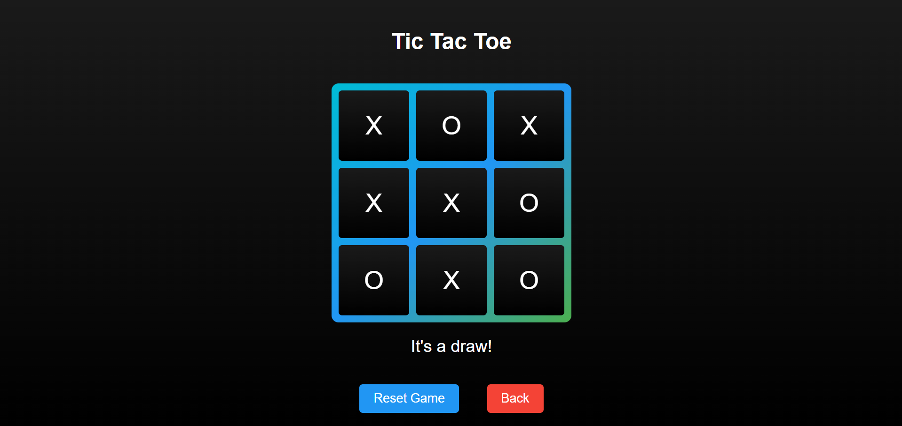

<h1 align="center">Mode Selection: </h1>

<h1 align="center">Vs AI: </h1>

<h1 align="center">Two Player: </h1>

<h1>Key Features: </h1>

- 🎮 Adaptable UI: Experience a responsive and adaptable user interface that adjusts seamlessly to different screen sizes and devices, providing a consistent gaming experience.

- 🕹️ Game Modes: Choose between two exciting game modes for endless fun and challenge
  
- Play Against AI: Test your skills against an intelligent AI opponent that offers various difficulty levels, providing a challenging single-player experience.
  
- Two Player Mode: Challenge a friend or family member in a classic head-to-head match, perfect for friendly competitions and social gaming.
  
- 👥 Two Player Interaction: Enjoy interactive gameplay in the "Two Player Mode," where players can take turns making moves, fostering strategy and communication between opponents.
  
- 📱 Mobile-Friendly Design: Whether you're playing on a desktop, tablet, or smartphone, our game is designed to be mobile-friendly, ensuring a smooth and enjoyable gaming experience on any device.
  

